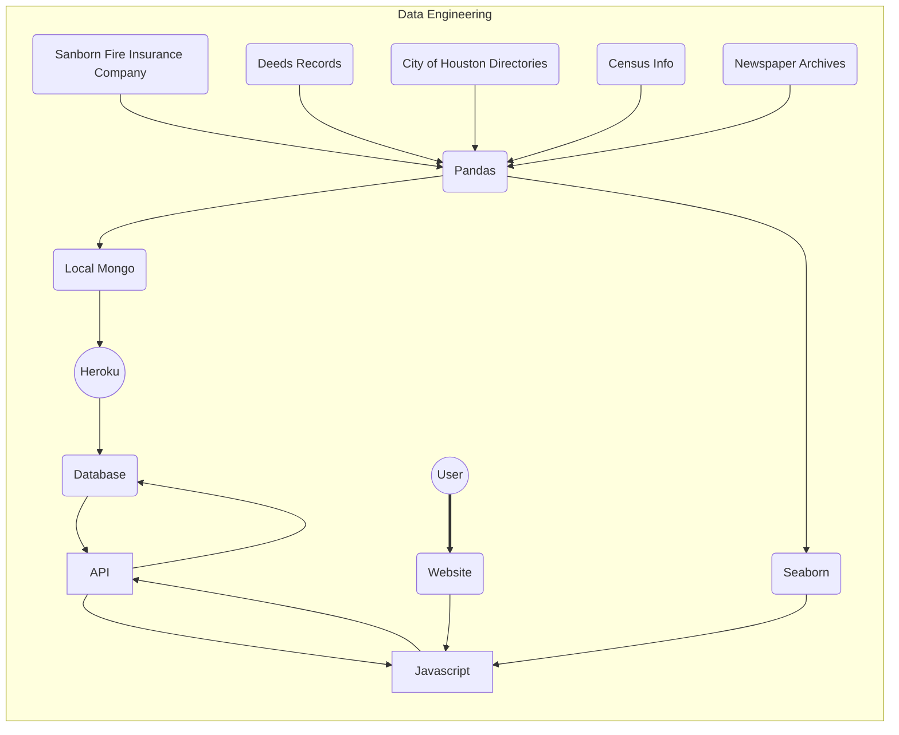

# Digital Humanities

<br>

[](https://vizgjk-reservations.herokuapp.com/)
[](http://vizgjk-reservations.herokuapp.com/api/maps/1900)

<br>

<details>
<summary>Table of Contents</summary>

- [Overview](#overview)
- [Motivation](#goals)
- [Build Status](#build-status)
- [The Code](#the-data)
- [Framework](#tech)
- [Dependencies](#dependencies)
- [References](#references)

</details>

# Overview

While working on the data, we continued to investigate the the story of the Reservation. In spite of the poorly gathered census data of the area, we were able to make a few cursory conclusions back by the data of the time. We found that the red-light district helped what was described as "a few huts" develop into a thriving community. The data showed that the population on the Reservation was growing faster than the neighboring City of Houston. Despite the segregation that was commonplace during the period, we saw an influx of caucaisan Houstonians moving into the area. It is likely that most of these individuals were prostitutes hoping to work in the area, but, with the rise of business in their field, a marked rise in the number of black owned and operated business popped up inside and outside the area. That success may have attracted negative attention from those that wished to see the neighborhood fail and no matter the reasoning, the City of Houston almost completely annexed the area by the early 1920's. The Reservation started to decline after the red-light district was shut down due to pressure from a nearby army base to remove the distraction.

# Goals

This project is a collaboration with the Rice Humanities Department and Professor Brian Riedel et al.
<br>

We helped clean and organize the data as well as provide a platform upon which further advancements could be made. We established a server with a functioning API that will allow future endeavors to pull the data in a computer friendly format. To further that goal, we've established a method for mounting that data on a number of popular online map generation libraries. In the future we hope to provide a website where interested Houstonians can learn more about an intriguing part of their city's history.

# Build Status

[](https://GitHub.com/Wired361/Digital-Humanities/graphs/contributors/)
[](https://GitHub.com/Wired361/Digital-Humanities/commit/)
[](https://GitHub.com/Wired361/Digital-Humanities/commit/)

# The Data

A sample entry of an API response:

```
{
    "Street Address":"834 Arthur St",
    "Full Name":"Betsy Pickett ©; Laura Pickett © servt; Lucy Pickett ©",
    "Race_Color":"B",
    "Latitude":-95.37708413,"Longitude":29.75856158
}
```

# Tech

[](https://github.com/Wired361/Digital-Humanities/network/dependencies)



Path of the Data

# References

[The Reservation](https://arcgis.com/apps/Cascade/index.html?appid=2262a3c6c67e4f1ebd2261ca8f82a267)
